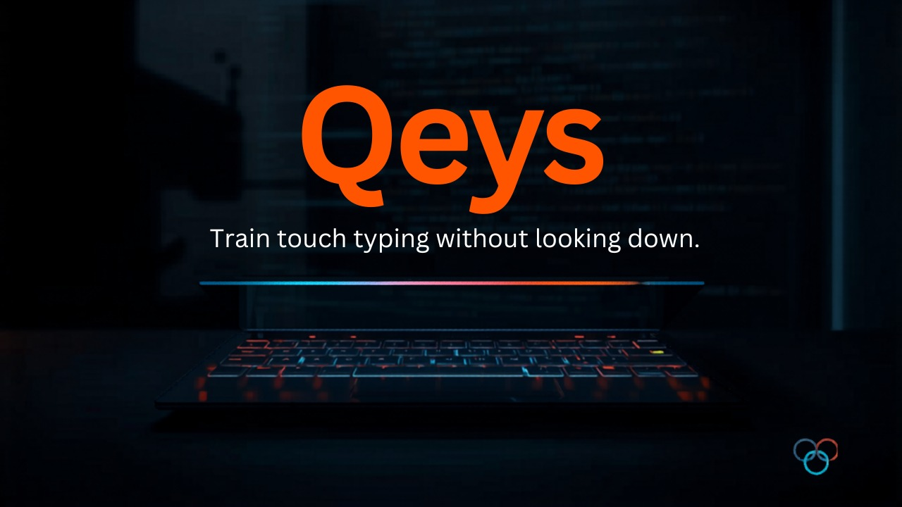

# Qeys — a no-look typing trainer



**Qeys** is a lightweight, always-on-top **QWERTY keyboard overlay** for Windows that
mirrors your **real typing in any app or browser tab** in real time. Press a key
anywhere and it lights up amber on the overlay, then fades out slowly — so you can
train your fingers without ever looking down at the physical keyboard.

It also includes a **practice mode**: type the prompt sentence and watch your **live
words-per-minute and accuracy**.

## Why it helps

Most typing tutors force you to type *into their box*. The problem with no-look
(touch) typing is that the moment you glance down to check a key, you break the
muscle-memory loop you're trying to build.

Qeys flips that:

- **Glance up, not down.** Your eyes stay at screen level — on a clean on-screen
  keyboard — instead of dropping to your hands.
- **The slow fade is the feedback.** A key stays lit briefly after release, so you see
  the trail of what you just pressed and catch wrong-finger habits.
- **Practice with live scoring.** Type the prompt; each character turns green (right)
  or red (wrong), and your WPM + accuracy update as you go.
- **Home-row anchors (F & J)** are marked so you can re-orient your fingers by feel.
- **It rides along with real work.** Borderless, semi-transparent, and parked in the
  tray — practice during actual typing instead of a separate drill app.

## Features

- 🌐 **Global** — captures keystrokes from any window via a system-wide hook
- 🔀 **Two modes** (toggle in the bar):
  - **Test** — scored practice against target prompts
  - **Free** — a plain real-time mirror of whatever you type
- 🎯 **Test mode** — target prompts with per-character correct/wrong coloring
- 📊 **Live WPM + accuracy**, plus last-run and best-WPM, and a completed counter
- 📌 **Always-on-top**, borderless, semi-transparent overlay
- 🖱️ **Drag anywhere** to move · **bottom-right grip** to resize (keyboard rescales)
- 🔆 **Instant light-up, slow fade** on release (tunable)
- 🪟 **System tray icon** — Show / Hide / New prompt / Quit; ✕ minimizes to tray
- 🏠 **F/J home-row markers** for blind finger placement

## Install & run

Requires **Python 3.8+** on Windows.

```bash
pip install -r requirements.txt
python qeys.py
```

### One-click launch (Windows)

Double-click **`Qeys.vbs`** — it starts the app silently (no console window) and drops
it into the system tray.

> ⚠️ **Note on the `.vbs` launcher:** it runs cleanly on the machine where it was
> created. If you *download* or copy it to a **different** PC, Windows may show a
> "Security Warning" / SmartScreen prompt (it flags `.vbs` files that arrive from the
> internet), and some managed machines disable Windows Script Host entirely. On a new
> machine, prefer `python qeys.py`. Nothing unsigned launches 100% dialog-free on
> Windows without a code-signing certificate.

## Controls

| Action | How |
|---|---|
| Switch Test / Free mode | Click the **Test** / **Free** toggle in the bar |
| Type / practice | Type anywhere; scored against the current prompt (Test mode) |
| Restart prompt (Test) / clear bar (Free) | `Ctrl+A` |
| Delete last char | `Backspace` |
| Skip to a new prompt | **▸** button (or tray → New prompt) |
| Move overlay | Drag anywhere on it |
| Resize | Drag the bottom-right corner grip |
| Minimize to tray | Click **✕** (top-right) |
| Show / Hide / Quit | Right-click the tray icon |
| Quit | `Esc` (while overlay focused) or tray → Quit |

## Tuning

Edit the constants at the top of [`qeys.py`](qeys.py):

| Constant | Default | Effect |
|---|---|---|
| `FADE_SECONDS` | `0.9` | Higher = slower fade-out after release |
| `OPACITY` | `0.7` | Window opacity: `1.0` solid, lower = more see-through |
| `ACTIVE_KEY` | amber | Highlight color (RGB) |
| `PROMPTS` | list | Add your own practice sentences |
| `FPS` | `60` | Redraw rate |

## Notes & caveats

- The global hook works without admin for normal apps. To capture keys typed inside an
  app launched **as administrator**, run Qeys as administrator too.
- The text bar tracks key *position*, not exact case — uppercase isn't reflected (the
  goal is finger memory).
- Windows-only as written (uses the `keyboard` hook + Win32 tray). The Tkinter UI is
  cross-platform, but the global hook may need root/extra permissions on macOS/Linux.

## Credits

Built by **[Qollab](https://jeffreyquemuel.cloud/qorex)** — the badge in the
bottom-left of the overlay links there. Logo © Qollab.

## License

MIT — see [LICENSE](LICENSE).
